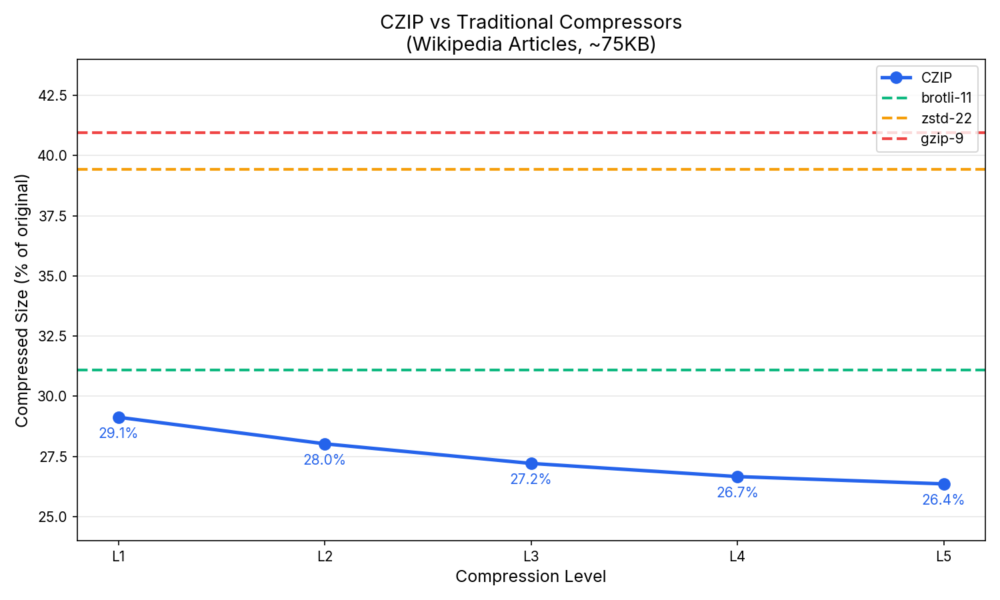

# compress-zip

CPU reference implementations (Rust and Python) for the [compress.zip](https://compress.zip) neural compression API.



## What is this?

This repo lets you independently verify compression ratios and determinism of data compressed through the compress.zip API. Both implementations produce bit-exact identical output, so you can validate that your compressed files decompress correctly without relying on our servers.

The compress.zip service lets you upload a text corpus, trains a bespoke tokenizer and compression model for your data, and then compresses/decompresses at 30-50 MB/s on GPU. You can export your trained model and use it with this repo for offline verification.

**Note:** The compress.zip service is currently in development. If you are interested in many orders of magnitude faster performance than this repo, feel free to email me at carson at poole.ai

## Compression Performance

Wikipedia articles (~15KB each), compressed size in bytes:

| Article | Original | CZIP L1 | CZIP L5 | brotli-11 | zstd-22 | gzip-9 |
|---------|----------|---------|-----------|-----------|---------|--------|
| Machine Learning | 15,003 | 3,956 | **3,552** | 4,303 | 5,541 | 5,783 |
| World War II | 15,024 | 4,397 | **3,944** | 4,729 | 5,914 | 6,139 |
| Python (PL) | 15,020 | 4,427 | **4,043** | 4,670 | 5,852 | 6,079 |
| Einstein | 15,038 | 4,511 | **4,070** | 4,920 | 6,306 | 6,546 |
| Rust (PL) | 15,014 | 4,585 | **4,188** | 4,727 | 6,001 | 6,217 |
| **Total** | 75,099 | 21,876 | **19,797** | 23,349 | 29,614 | 30,764 |

Compression improves monotonically with context length. L5 (1024 tokens) achieves **3.6-4.2x** compression ratio—15-20% better than brotli-11. The same model works at all levels.


### Comparison with Other Neural Compressors

| Compressor | Model | Compression | Speed | Hardware |
|------------|-------|-------------|-------|----------|
| **CZIP** | tiny GPT model | 3.6-4.2x | ~350k tok/s | CPU (Mac Studio) |
| [ts_zip](https://bellard.org/ts_zip/) | RWKV 169M | ~7x | ~577 tok/s | RTX 4090 GPU |
| [llama-zip](https://github.com/alexbuz/llama-zip) | Llama 3.1 8B | 8-29x | ~30 tok/s | GPU |


## How it works

Zero floating-point operations in the entire inference path. Every computation—matrix multiplies, attention scores, softmax, normalization—is pure integer math. Transcendental functions (exp, sin, cos for rotary embeddings) come from precomputed lookup tables, not FPU instructions.

This means you get bit-exact results on any hardware: x86, ARM, a microcontroller, a toaster with a CPU. No floating-point rounding differences, no platform-specific math libraries, no surprises.

- **Weights**: int8
- **Activations**: Q0.7 fixed-point
- **Accumulators**: int32
- **RMSNorm**: integer square root
- **Softmax**: exp2 LUT (Q16 output)
- **RoPE**: Q1.15 sin/cos tables
- **Arithmetic coder**: 32-bit state, E1/E2/E3 renormalization
- **Context length**: Configurable 64-4096 tokens (stored as power-of-2 in file header)

## Installation

### Rust

```bash
cd rust
cargo build --release
```

### Python

```bash
cd python
pip install -e ".[dev]"
```

## Usage

### Compress

```bash
# Rust
./target/release/compress_zip compress -m models/v001_eng.czm -i input.txt -o output.czip

# Python
python -m compress_zip compress -m models/v001_eng.czm -i input.txt -o output.czip
```

### Decompress

```bash
# Rust
./target/release/compress_zip decompress -m models/v001_eng.czm -i output.czip -o recovered.txt

# Python
python -m compress_zip decompress -m models/v001_eng.czm -i output.czip -o recovered.txt
```

### Options

- `-m, --model` — Path to model file (safetensors format)
- `-t, --tokenizer` — Tokenizer path (default: uses tokenizer embedded in model)
- `-c, --codec` — Outer compression: `brotli` (default) or `zstd`
- `-L, --level` — Compression level 1-5 (context: 1=64, 2=128, 3=256, 4=512, 5=1024 tokens)

## Running Tests

```bash
cd rust && cargo test

cd python && pytest tests/ -v
```

## License
MIT